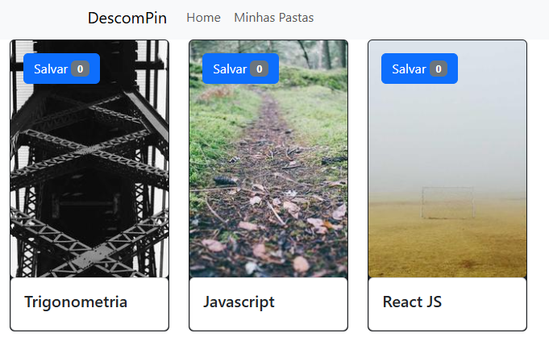

# 📂 DescomPin - Gerenciador de Pastas

Aplicação desenvolvida com React que permite criar e salvar pastas de forma dinâmica, utilizando LocalStorage para persistência de dados.

🔗 **Acesse o projeto online:**  
https://react-local-storage.netlify.app

---

## 🖼️ Preview

---

## 📌 Sobre o Projeto

O DescomPin é uma aplicação desenvolvida em React que permite ao usuário criar pastas personalizadas e armazená-las localmente no navegador.

Os dados permanecem salvos mesmo após atualizar a página, graças ao uso do LocalStorage.

---

## 🛠️ Tecnologias Utilizadas

- React  
- JavaScript (ES6+)  
- HTML5  
- CSS3  

---

## ✨ Funcionalidades

- Criação dinâmica de pastas  
- Armazenamento dos dados no LocalStorage  
- Persistência de informações após recarregar a página  
- Interface organizada com uso de componentes  
- Estrutura baseada em React Hooks  

---

## 🎯 Objetivos do Projeto

- Praticar criação e reutilização de componentes  
- Trabalhar gerenciamento de estado no React  
- Implementar persistência de dados no navegador  
- Aplicar boas práticas de organização de código  

---

## 💼 Competências Demonstradas

- Manipulação de estado com React  
- Uso de Hooks (como useState)  
- Integração com LocalStorage  
- Estruturação de aplicação baseada em componentes  
- Organização e clareza no código  

---

## 👩‍💻 Desenvolvedora

Wanessa Antonio  
